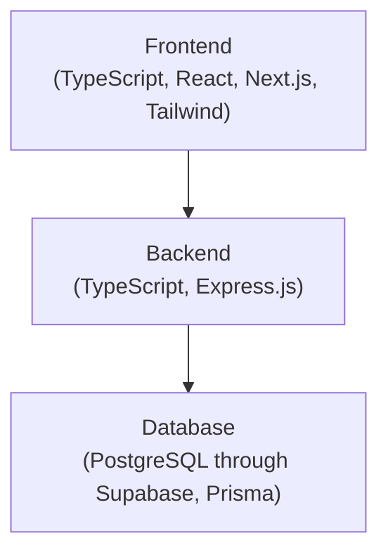

### Merchant Lens

An analytics tool that provides merchants with data on their revenue, customer behavior, and product performance.

---

#### Functionality

    
| Feature              | Description                                         |
|----------------------|-----------------------------------------------------|
| Overview Metrics     | Quickly view key merchant data                      |
| Customer Insights    | Track top, new, and returning customers             |
| Monthly Summaries    | Compare revenue and order trends                    |
| Revenue Tracking     | Analyze daily, weekly, monthly, and yearly revenue  |
| Product Performance  | See top-selling and highest-revenue products        |
| Custom Timeframes    | Filter metrics for any desired period               |
    

---

#### Architecture

